# MySQL Cluster & ProxySQL


#### 05111540000119 - Cahya Putra Hikmawan
##### https://github.com/cphikmawan/database-distributed-courses

### Outline
[1. Tujuan](#1-tujuan)

[2. Arsitektur Sistem](#2-arsitektur-sistem)

- [2.1 - MySQL Cluster](#21-mysql-cluster)
- [2.2 - ProxySQL](#22-proxysql)

[3. Deployment & Testing](#3-deployment-and-testing)

- [3.1 - Vagrant](#31-vagrant)
- [3.2 - Provisioning](#32-provisioning)
- [3.3 - Testing](#33-testing)

### 1. Tujuan
- Pada tugas ini, mahasiswa diharapkan mampu untuk

1. Membuat server basis data terdistribusi dengan menggunakan konsep group replication

2. Mampu menambahkan load balancer (ProxySQL) untuk membagi request ke server basis data

3. Menambahkan aplikasi CMS (Wordpress) yang memanfaatkan arsitektur tersebut

4. Menguji kehandalan sistem (testing) dengan menyimulasikan matinya beberapa node dan menunjukkan bahwa data tetap tereplikasi pada node-node server basis data.


### 2. Arsitektur Sistem
#### 2.1 MySQL Cluster
|||
| --- | --- |
| Sistem Operasi | Ubuntu 18.04.1 LTS |
| Versi MySQL | 5.7.23 |
| RAM | 8 GB |
| CPU | 4 Core |

| No | Host | IP Address |
| --- | --- | --- |
| 1 | db1 | 192.168.33.11 |
| 2 | db2 | 192.168.33.12 |
| 3 | db3 | 192.168.33.13 |

#### 2.2 ProxySQL

| No | Host | IP Address |
| --- | --- | --- |
| 1 | proxy | 192.168.33.10 |

### 3. Deployment and Testing
#### 3.1 Vagrant
##### Prep - Install VirtualBox & Vagrant
```sh
$ sudo apt install vagrant
$ sudo apt install virtualbox
```

##### Step 1 - Download Template
Unzip mysql-cluster-proxysql.zip
```sh
$ unzip mysql-cluster-proxysql.zip
$ cd mysql-cluster-proxysql
```

##### Step 2 - Run Vagrantfile
> **INFO: Direkomendasikan untuk melakukan _vagrant up_ setelah edit _provisioning_ dan persiapan lainnya.**

```sh
$ vagrant up
```

> Jika langsung melakukan **_vagrant up_** Maka akan muncul beberapa kemungkinan **_error_** yaitu: :
> 1. Muncul _**/vagrant/* no such file or directory**_
> 2. Interface **_error_**
> 3. **_Memory_** tidak memenuhi

> Bagaimana cara mengatasinya? (edit Vagrantfile)
> 1. Sinkronisasi folder **_config.vm.synced_folder ".", "/vagrant"_**
> 2. Edit Interface **_node.vm.network "public_network", bridge: "enp2s0"_** (dalam kasus ini interface pada pc yang digunakan yaitu **_enp2s0_**)
> 3. Ubah **_vb.memory = "512_"**

- [Vagrantfile](my-vagrant/Vagrantfile) - Edit Vagrantfile sesuai penjelasan di atas
```rb
# -*- mode: ruby -*-
# vi: set ft=ruby :

# All Vagrant configuration is done below. The "2" in Vagrant.configure
# configures the configuration version (we support older styles for
# backwards compatibility). Please don't change it unless you know what
# you're doing.

Vagrant.configure("2") do |config|
  # sinkronisasi folder
  config.vm.synced_folder ".", "/vagrant"
  # MySQL Cluster dengan 3 node
  (1..3).each do |i|
    config.vm.define "db#{i}" do |node|
      node.vm.hostname = "db#{i}"
      node.vm.box = "bento/ubuntu-16.04"
      node.vm.network "private_network", ip: "192.168.33.1#{i}"

      # Opsional. Edit sesuai dengan nama network adapter di komputer
      node.vm.network "public_network", bridge: "enp2s0"
      node.vm.provider "virtualbox" do |vb|
        vb.name = "db#{i}"
        vb.gui = false
        vb.memory = "512"
      end
  
      node.vm.provision "shell", path: "deployMySQL1#{i}.sh", privileged: false
    end
  end

  config.vm.define "proxy" do |proxy|
    proxy.vm.hostname = "proxy"
    proxy.vm.box = "bento/ubuntu-16.04"
    proxy.vm.network "private_network", ip: "192.168.33.10"
    proxy.vm.network "public_network",  bridge: "enp2s0"
    
    proxy.vm.provider "virtualbox" do |vb|
      vb.name = "proxy"
      vb.gui = false
      vb.memory = "512"
    end

    proxy.vm.provision "shell", path: "deployProxySQL.sh", privileged: false
  end

end
```

#### 3.2 Provisioning
- Ada 4 tahap provisioning yang dilakukan yaitu :
1. Provisioning pada host _db1_ (tanpa modifikasi)
1. Provisioning pada host _db2_ (tanpa modifikasi)
1. Provisioning pada host _db3_ (tanpa modifikasi)
1. Provisioning pada host _proxy_ (dengan modifikasi)

##### Step 1 - Provisioning pada host _db1_
- [deployMySQL11.sh](my-vagrant/deployMySQL11.sh)
```sh
sudo apt-get update
sudo apt-get install libaio1
sudo apt-get install libmecab2
curl -OL https://dev.mysql.com/get/Downloads/MySQL-5.7/mysql-common_5.7.23-1ubuntu16.04_amd64.deb
curl -OL https://dev.mysql.com/get/Downloads/MySQL-5.7/mysql-community-client_5.7.23-1ubuntu16.04_amd64.deb
curl -OL https://dev.mysql.com/get/Downloads/MySQL-5.7/mysql-client_5.7.23-1ubuntu16.04_amd64.deb
curl -OL https://dev.mysql.com/get/Downloads/MySQL-5.7/mysql-community-server_5.7.23-1ubuntu16.04_amd64.deb
sudo debconf-set-selections <<< 'mysql-community-server mysql-community-server/root-pass password admin'
sudo debconf-set-selections <<< 'mysql-community-server mysql-community-server/re-root-pass password admin'
sudo dpkg -i mysql-common_5.7.23-1ubuntu16.04_amd64.deb
sudo dpkg -i mysql-community-client_5.7.23-1ubuntu16.04_amd64.deb
sudo dpkg -i mysql-client_5.7.23-1ubuntu16.04_amd64.deb
sudo dpkg -i mysql-community-server_5.7.23-1ubuntu16.04_amd64.deb
sudo ufw allow 33061
sudo ufw allow 3306
sudo cp /vagrant/my11.cnf /etc/mysql/my.cnf
sudo service mysql restart
sudo mysql -u root -padmin < /vagrant/cluster_bootstrap.sql
sudo mysql -u root -padmin < /vagrant/addition_to_sys.sql
sudo mysql -u root -padmin < /vagrant/create_proxysql_user.sql
```

bash scripting tidak ada yang dimodifikasi, namun kita harus memodifikasi pada bagian **cluster_bootstrap.sql** & **create_proxysql_user.sql**

- [cluster_bootstrap.sql](my-vagrant/cluster_bootstrap.sql) - Membuat database **wordpress**
```sql
SET SQL_LOG_BIN=0;
CREATE USER 'repl'@'%' IDENTIFIED BY 'password' REQUIRE SSL;
GRANT REPLICATION SLAVE ON *.* TO 'repl'@'%';
FLUSH PRIVILEGES;
SET SQL_LOG_BIN=1;
CHANGE MASTER TO MASTER_USER='repl', MASTER_PASSWORD='password' FOR CHANNEL 'group_replication_recovery';
INSTALL PLUGIN group_replication SONAME 'group_replication.so';

SET GLOBAL group_replication_bootstrap_group=ON;
START GROUP_REPLICATION;
SET GLOBAL group_replication_bootstrap_group=OFF;

CREATE DATABASE wordpress;
CREATE DATABASE playground;
CREATE TABLE playground.equipment ( id INT NOT NULL AUTO_INCREMENT, type VARCHAR(50), quant INT, color VARCHAR(25), PRIMARY KEY(id));
INSERT INTO playground.equipment (type, quant, color) VALUES ("slide", 2, "blue");
```

- [create_proxysql_user.sql](my-vagrant/create_proxysql_user.sql) - Membuat user **wordpress**
```sql
CREATE USER 'monitor'@'%' IDENTIFIED BY 'monitorpassword';
GRANT SELECT on sys.* to 'monitor'@'%';
FLUSH PRIVILEGES;

CREATE USER 'playgrounduser'@'%' IDENTIFIED BY 'playgroundpassword';
GRANT ALL PRIVILEGES on playground.* to 'playgrounduser'@'%';
FLUSH PRIVILEGES;

CREATE USER 'wordpress'@'%' IDENTIFIED BY 'wordpress';
GRANT ALL PRIVILEGES on wordpress.* to 'wordpress'@'%';
FLUSH PRIVILEGES;
```

##### Step 2 - Provisioning pada host _db2_
- [deployMySQL12.sh](my-vagrant/deployMySQL12.sh)
```sh
sudo apt-get update
sudo apt-get install libaio1
sudo apt-get install libmecab2
curl -OL https://dev.mysql.com/get/Downloads/MySQL-5.7/mysql-common_5.7.23-1ubuntu16.04_amd64.deb
curl -OL https://dev.mysql.com/get/Downloads/MySQL-5.7/mysql-community-client_5.7.23-1ubuntu16.04_amd64.deb
curl -OL https://dev.mysql.com/get/Downloads/MySQL-5.7/mysql-client_5.7.23-1ubuntu16.04_amd64.deb
curl -OL https://dev.mysql.com/get/Downloads/MySQL-5.7/mysql-community-server_5.7.23-1ubuntu16.04_amd64.deb
sudo debconf-set-selections <<< 'mysql-community-server mysql-community-server/root-pass password admin'
sudo debconf-set-selections <<< 'mysql-community-server mysql-community-server/re-root-pass password admin'
sudo dpkg -i mysql-common_5.7.23-1ubuntu16.04_amd64.deb
sudo dpkg -i mysql-community-client_5.7.23-1ubuntu16.04_amd64.deb
sudo dpkg -i mysql-client_5.7.23-1ubuntu16.04_amd64.deb
sudo dpkg -i mysql-community-server_5.7.23-1ubuntu16.04_amd64.deb
sudo ufw allow 33061
sudo ufw allow 3306
sudo cp /vagrant/my12.cnf /etc/mysql/my.cnf
sudo service mysql restart
sudo mysql -u root -padmin < /vagrant/cluster_member.sql
```

##### Step 3 - Provisioning pada host _db3_
- [deployMySQL13.sh](my-vagrant/deployMySQL13.sh)
```sh
sudo apt-get update
sudo apt-get install libaio1
sudo apt-get install libmecab2
curl -OL https://dev.mysql.com/get/Downloads/MySQL-5.7/mysql-common_5.7.23-1ubuntu16.04_amd64.deb
curl -OL https://dev.mysql.com/get/Downloads/MySQL-5.7/mysql-community-client_5.7.23-1ubuntu16.04_amd64.deb
curl -OL https://dev.mysql.com/get/Downloads/MySQL-5.7/mysql-client_5.7.23-1ubuntu16.04_amd64.deb
curl -OL https://dev.mysql.com/get/Downloads/MySQL-5.7/mysql-community-server_5.7.23-1ubuntu16.04_amd64.deb
sudo debconf-set-selections <<< 'mysql-community-server mysql-community-server/root-pass password admin'
sudo debconf-set-selections <<< 'mysql-community-server mysql-community-server/re-root-pass password admin'
sudo dpkg -i mysql-common_5.7.23-1ubuntu16.04_amd64.deb
sudo dpkg -i mysql-community-client_5.7.23-1ubuntu16.04_amd64.deb
sudo dpkg -i mysql-client_5.7.23-1ubuntu16.04_amd64.deb
sudo dpkg -i mysql-community-server_5.7.23-1ubuntu16.04_amd64.deb
sudo ufw allow 33061
sudo ufw allow 3306
sudo cp /vagrant/my13.cnf /etc/mysql/my.cnf
sudo service mysql restart
sudo mysql -u root -padmin < /vagrant/cluster_member.sql
```

##### Step 4 - Provisioning pada host _proxy_
- [deployProxySQL.sh](my-vagrant/deployProxySQL.sh)
```sh
sudo apt-get update
cd /tmp
curl -OL https://github.com/sysown/proxysql/releases/download/v1.4.4/proxysql_1.4.4-ubuntu16_amd64.deb
curl -OL https://dev.mysql.com/get/Downloads/MySQL-5.7/mysql-common_5.7.23-1ubuntu16.04_amd64.deb
curl -OL https://dev.mysql.com/get/Downloads/MySQL-5.7/mysql-community-client_5.7.23-1ubuntu16.04_amd64.deb
curl -OL https://dev.mysql.com/get/Downloads/MySQL-5.7/mysql-client_5.7.23-1ubuntu16.04_amd64.deb

sudo apt-get install libaio1
sudo apt-get install libmecab2
sudo dpkg -i proxysql_1.4.4-ubuntu16_amd64.deb
sudo dpkg -i mysql-common_5.7.23-1ubuntu16.04_amd64.deb
sudo dpkg -i mysql-community-client_5.7.23-1ubuntu16.04_amd64.deb
sudo dpkg -i mysql-client_5.7.23-1ubuntu16.04_amd64.deb

#install apache
sudo apt-get install -y apache2
sudo systemctl start apache2

#install php and related modules
sudo apt-get install -y php7.0 libapache2-mod-php7.0 php7.0-mysql php7.0-curl php7.0-mbstring php7.0-gd php7.0-xml php7.0-xmlrpc php7.0-intl php7.0-soap php7.0-zip

# install wordpress
cd /tmp
wget -c http://wordpress.org/latest.tar.gz
tar -xzvf latest.tar.gz
sudo mv wordpress/* /var/www/html
sudo cp /vagrant/wp-config.php /var/www/html/
sudo chown -R www-data:www-data /var/www/html/
sudo chmod -R 755 /var/www/html/
sudo mv /var/www/html/index.html /var/www/html/index.html.bak
sudo systemctl restart apache2

sudo ufw allow 33061
sudo ufw allow 3306

sudo systemctl start proxysql
#mysql -u admin -padmin -h 127.0.0.1 -P 6032 < /vagrant/proxysql.sql
```

> **_Keterangan_**
> 1. Modifikasi install apache 
> 2. Modifikasi install php
> 3. Modifikasi install wordpress
> 4. Menambahkan file [**_wp-config.php_**](my-vagrant/wp-config.php)

- [wp-config.php](my-vagrant/wp-config.php)
```php
<?php
/**
 * The base configuration for WordPress
 *
 * The wp-config.php creation script uses this file during the
 * installation. You don't have to use the web site, you can
 * copy this file to "wp-config.php" and fill in the values.
 *
 * This file contains the following configurations:
 *
 * * MySQL settings
 * * Secret keys
 * * Database table prefix
 * * ABSPATH
 *
 * @link https://codex.wordpress.org/Editing_wp-config.php
 *
 * @package WordPress
 */

// ** MySQL settings - You can get this info from your web host ** //
/** The name of the database for WordPress */
define('DB_NAME', 'wordpress');

/** MySQL database username */
define('DB_USER', 'wordpress');

/** MySQL database password */
define('DB_PASSWORD', 'wordpress');

/** MySQL hostname */
define('DB_HOST', '192.168.33.10:6033');

/** Database Charset to use in creating database tables. */
define('DB_CHARSET', 'utf8');

/** The Database Collate type. Don't change this if in doubt. */
define('DB_COLLATE', '');

/**#@+
 * Authentication Unique Keys and Salts.
 *
 * Change these to different unique phrases!
 * You can generate these using the {@link https://api.wordpress.org/secret-key/1.1/salt/ WordPress.org secret-key service}
 * You can change these at any point in time to invalidate all existing cookies. This will force all users to have to log in again.
 *
 * @since 2.6.0
 */
define('AUTH_KEY',         'put your unique phrase here');
define('SECURE_AUTH_KEY',  'put your unique phrase here');
define('LOGGED_IN_KEY',    'put your unique phrase here');
define('NONCE_KEY',        'put your unique phrase here');
define('AUTH_SALT',        'put your unique phrase here');
define('SECURE_AUTH_SALT', 'put your unique phrase here');
define('LOGGED_IN_SALT',   'put your unique phrase here');
define('NONCE_SALT',       'put your unique phrase here');

/**#@-*/

/**
 * WordPress Database Table prefix.
 *
 * You can have multiple installations in one database if you give each
 * a unique prefix. Only numbers, letters, and underscores please!
 */
$table_prefix  = 'wp_';

/**
 * For developers: WordPress debugging mode.
 *
 * Change this to true to enable the display of notices during development.
 * It is strongly recommended that plugin and theme developers use WP_DEBUG
 * in their development environments.
 *
 * For information on other constants that can be used for debugging,
 * visit the Codex.
 *
 * @link https://codex.wordpress.org/Debugging_in_WordPress
 */
define('WP_DEBUG', false);

/* That's all, stop editing! Happy blogging. */

/** Absolute path to the WordPress directory. */
if ( !defined('ABSPATH') )
	define('ABSPATH', dirname(__FILE__) . '/');

/** Sets up WordPress vars and included files. */
require_once(ABSPATH . 'wp-settings.php');

```

##### Finishing
1. Setelah melakukan modifikasi seperti di atas, jalankan **_vagrant up_**
```sh
$ vagrant up
```

2. Modifikasi **_proxysql.sql_**
- [proxysql.sql](my-vagrant/proxysql.sql) - Modifikasi tambah user **_wordpress_** pada ProxySQL
```sql
UPDATE global_variables SET variable_value='admin:password' WHERE variable_name='admin-admin_credentials';
LOAD ADMIN VARIABLES TO RUNTIME;
SAVE ADMIN VARIABLES TO DISK;

UPDATE global_variables SET variable_value='monitor' WHERE variable_name='mysql-monitor_username';
LOAD MYSQL VARIABLES TO RUNTIME;
SAVE MYSQL VARIABLES TO DISK;

INSERT INTO mysql_group_replication_hostgroups (writer_hostgroup, backup_writer_hostgroup, reader_hostgroup, offline_hostgroup, active, max_writers, writer_is_also_reader, max_transactions_behind) VALUES (2, 4, 3, 1, 1, 3, 1, 100);

INSERT INTO mysql_servers(hostgroup_id, hostname, port) VALUES (2, '192.168.33.11', 3306);
INSERT INTO mysql_servers(hostgroup_id, hostname, port) VALUES (2, '192.168.33.12', 3306);
INSERT INTO mysql_servers(hostgroup_id, hostname, port) VALUES (2, '192.168.33.13', 3306);

LOAD MYSQL SERVERS TO RUNTIME;
SAVE MYSQL SERVERS TO DISK;

INSERT INTO mysql_users(username, password, default_hostgroup) VALUES ('playgrounduser', 'playgroundpassword', 2);
INSERT INTO mysql_users(username, password, default_hostgroup) VALUES ('wordpress', 'wordpress', 2);
LOAD MYSQL USERS TO RUNTIME;
SAVE MYSQL USERS TO DISK;
```

3. Jalankan perintah berikut untuk provisioning ProxySQL
```sh
$ vagrant ssh proxy
$ mysql -u admin -p -h 127.0.0.1 -P 6032 < /vagrant/proxysql.sql
```

> Kenapa provision untuk proxysql.sql dilakukan manual dan tidak ditaruh pada file **_deployProxySQL.sh_** ?

> Karena ketika akan menjalankan provisioning diperlukannya koneksi ke database dengan user admin, namun user admin hanya diperbolehkan akses hanya dari koneksi lokalnya saja

3. Konfigurasi dan Installasi Wordpress
- Akses **_IP ProxySQL_** pada browser http://192.168.33.10
- Maka akan muncul gambar sebagai berikut :

1. Pilih Bahasa

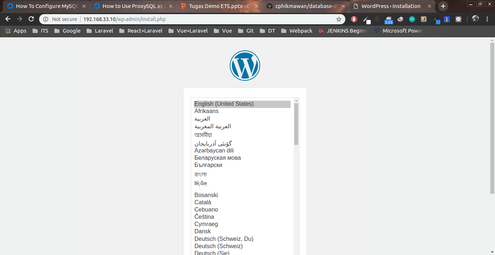

2. Input Judul dan Membuat Akun

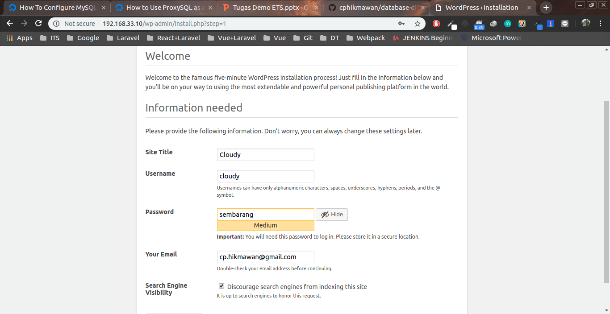

3. Informasi Status

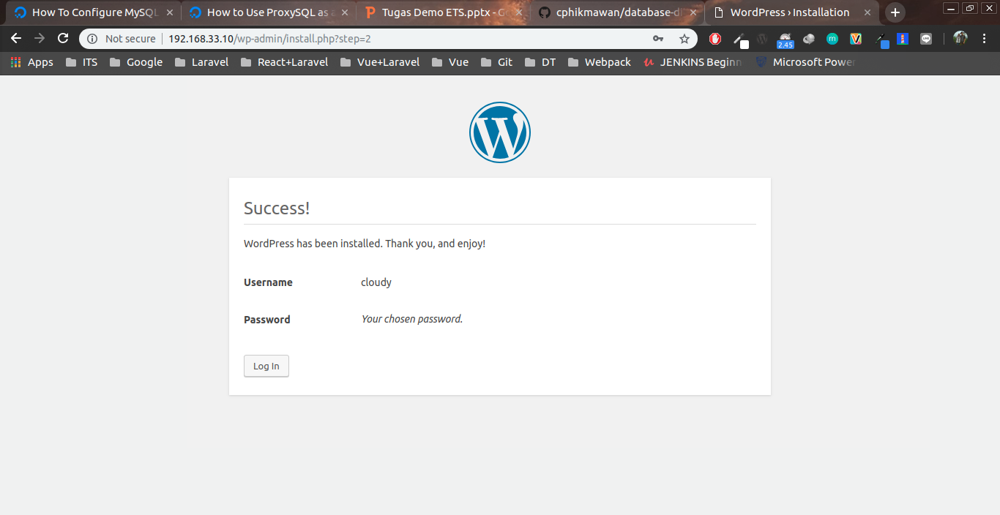

4. Login Form

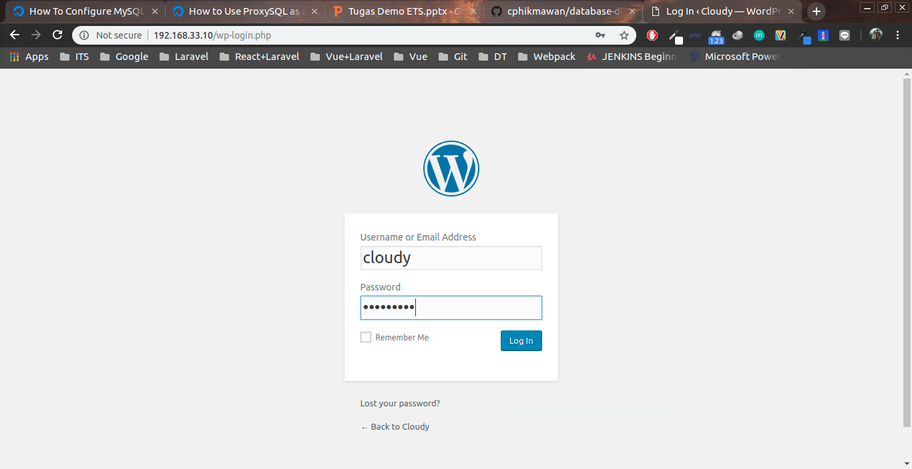

5. Dashboard

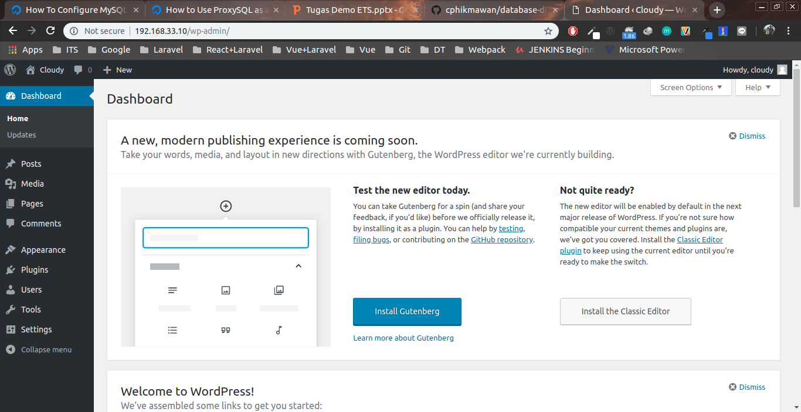

6. Dashboard

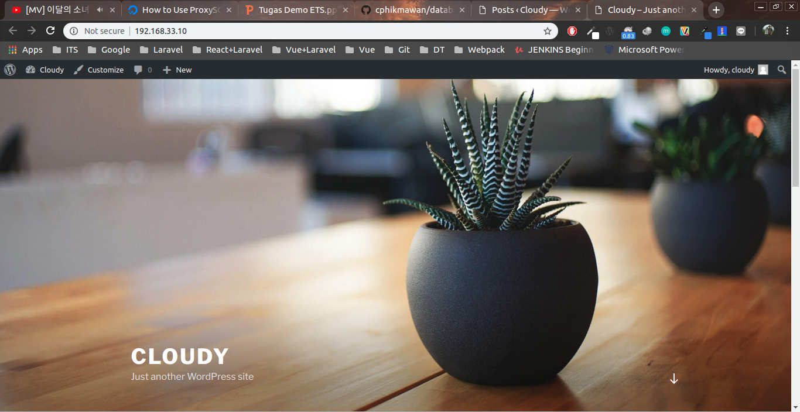

#### 3.3 Testing
##### 1. Tes Koneksi
- Step 1 - Pastikan bisa SSH ke semua host
```sh
$ vagrant ssh [nama_host]
```
> [namahost] = db1, db2, db3 atau proxy

contoh :
```sh
$ vagrant ssh db1
$ vagrant ssh db2
$ vagrant ssh db3
$ vagrant ssh proxy
```
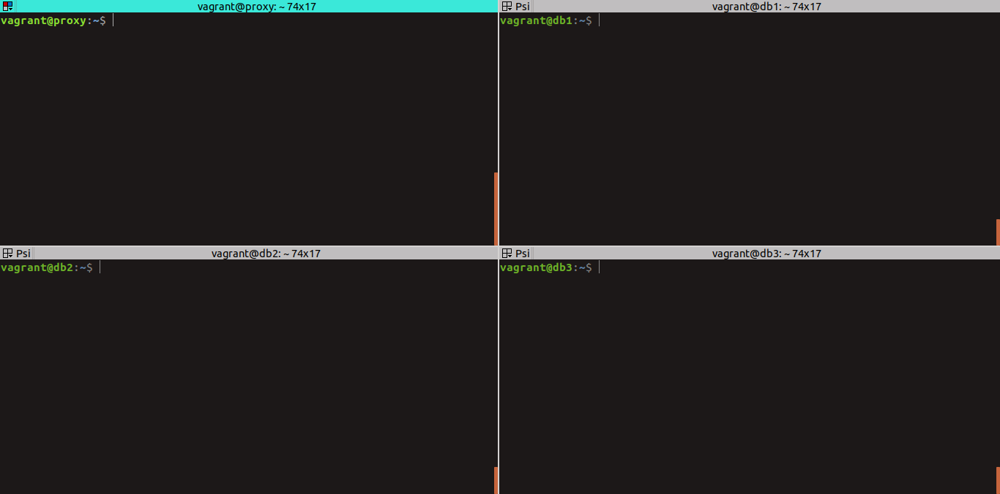

- Step 2 - Pastikan user dapat melakukan koneksi ke Group MySQL dari ProxySQL
```sh
$ mysql -u playgrounduser -p -h 127.0.0.1 -P 6033 --prompt='ProxySQLClient> '
```
> password: playgroundpassword

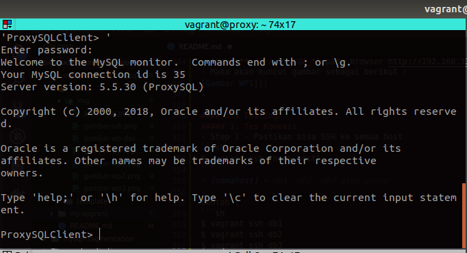

##### 2. Tes Replikasi
- Untuk tes replikasi bisa dilakukan dengan :
1. Cek pada group replication
2. Lakukan CRUD pada salah satu DB

Lebih gampangnya pada step membuat akun pada CMS **_Wordpress_** maka akan otomatis terbuat pada semua host, berikut buktinya :
- Step 1 - Login ke MySQL pada Group Replication Host
```sh
$ mysql -uroot -padmin
```

- Step 2 - Login ke MySQL pada ProxySQL menggunakan user **wordpress**
```sh
$ mysql -u wordpress -p -h 127.0.0.1 -P 6033 --prompt='ProxySQLClient> '
# password: wordpress
```

- Step 3 - Lakukan query
```sql
mysql> select * from wordpress.wp_users;
```
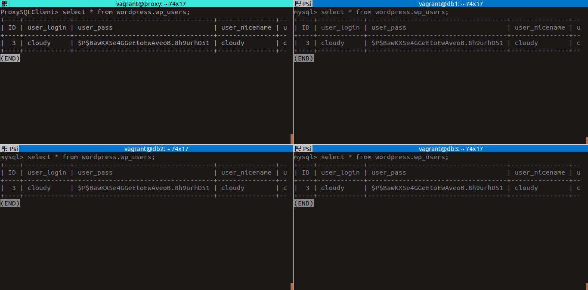

##### 3. Tes ProxySQL
- Step 1 - Matikan salah satu node MySQL Server (db1, db2 atau db3)
1. Pada host **_db3_**
```sh
(db3) $ sudo systemctl stop mysql
```
2. Cek pada host **_db3_**
```sh
(db3) $ sudo systemctl status mysql
```
3. Cek pada ProxySQL admin
```sql
mysql> SELECT hostgroup_id, hostname, status FROM runtime_mysql_servers;
```

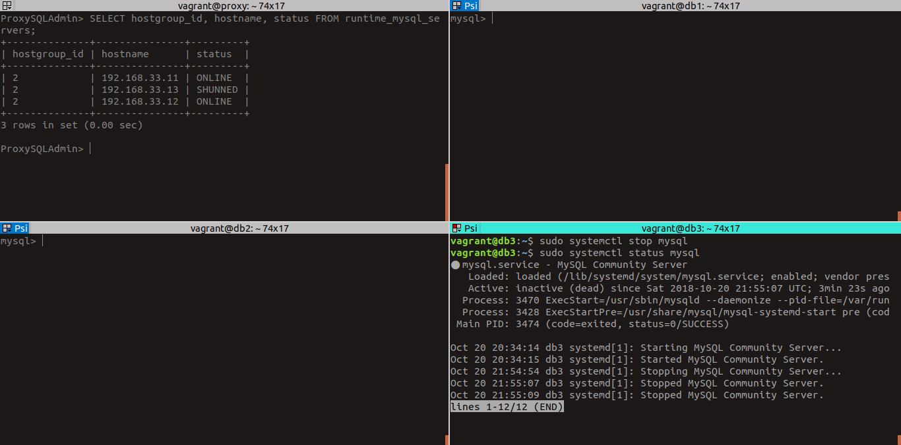

- Step 2 - Coba Posting

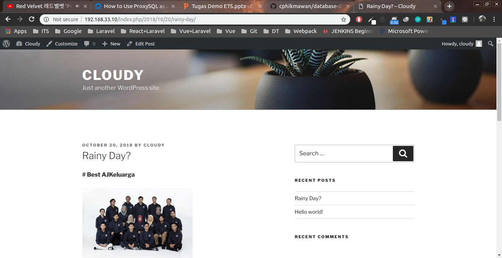

- Step 3 - Nyalakan node yang dimatikan
1. Pada host **_db3_**
```sh
$ sudo systemctl start mysql
```

- Step 4 - Cek post berhasil direplikasi atau tidak
```sql
mysql> select * from wp_posts;
```

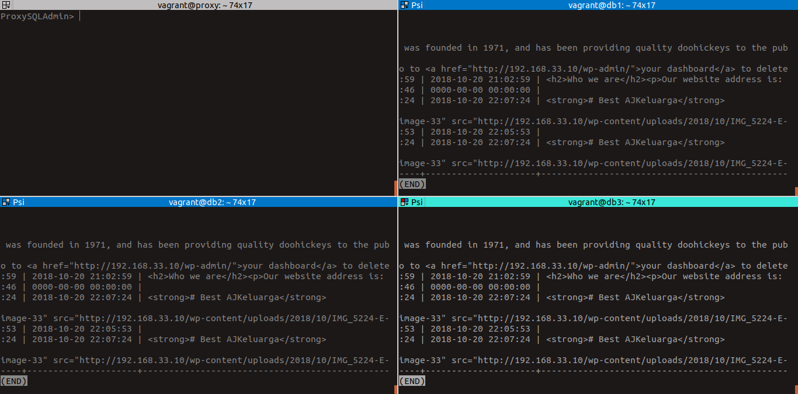

Sekian.